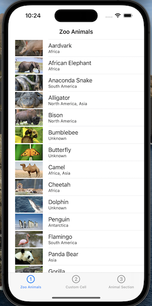
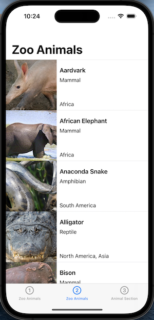
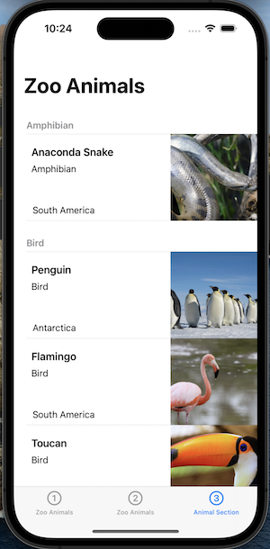
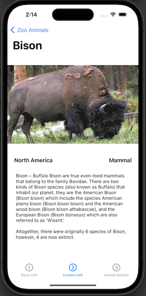

# ZooAnimals 

## Description

The purpose of this app is to demonstrate various table view cell layouts
 - The first table view consists of basic cell
 - The second table view consists of custom cells
 - The third table view consists of custom cells and sections
 - The app also includes a detail view when a cell is selected
 
 ## Screenshots
 
 ### Basic Cell
 
 
 
 ### Custom cell
 
 
 
 ### Sections
 
 
 ### Detail View
 
 
